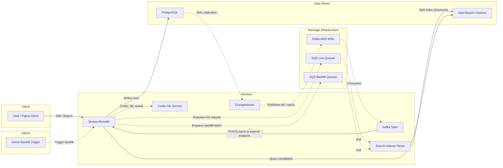

```mermaid
flowchart LR
    subgraph client ["Client"]
        user[User / Figma Client]
    end
    subgraph service ["Services"]
        sinatra[Sinatra Monolith]
        changestream[Changestream]
        kafkaTailer[Kafka Tailer]
        searchIndexer[Search-Indexer Fleets]
        cortex[Cortex ML Service]
    end
    subgraph datastore ["Data Stores"]
        postgres[PostgreSQL]
        openSearch[OpenSearch Clusters]
    end
    subgraph async ["Message Infrastructure"]
        kafka[Kafka AWS MSK]
        liveQueue[SQS Live Queues]
        backfillQueue[SQS Backfill Queues]
    end
    subgraph external ["Admin"]
        admin[Admin Backfill Trigger]
    end

    user -->|"Edit / Search"| sinatra
    sinatra -->|"Writes rows"| postgres
    postgres -.->|"WAL replication"| changestream
    changestream -.->|"Publishes db.* topics"| kafka
    kafka -.->|"Consumes"| kafkaTailer
    kafkaTailer -->|"POSTs batch to internal endpoint"| sinatra
    sinatra -.->|"Enqueue live request"| liveQueue
    admin -.->|"Trigger backfill"| sinatra
    sinatra -.->|"Enqueue backfill batch"| backfillQueue
    liveQueue -.->|"Poll"| searchIndexer
    backfillQueue -.->|"Poll"| searchIndexer
    searchIndexer -->|"Bulk index documents"| openSearch
    sinatra -->|"Query candidates"| openSearch
    sinatra -.->|"Cortex: ML rerank"| cortex
```
