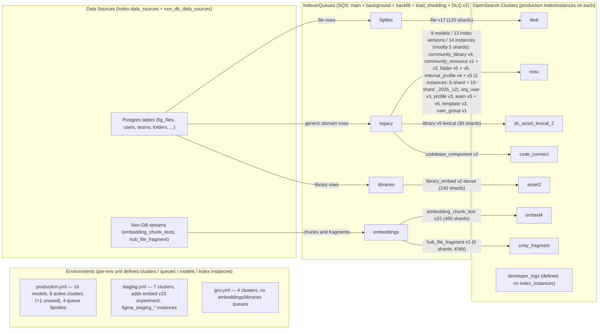

```mermaid
flowchart LR
    subgraph env ["Environments (per-env yml defines clusters / queues / models / index instances)"]
        prod["production.yml — 16 models, 8 active clusters (+1 unused), 4 queue families"]
        staging["staging.yml — 7 clusters, adds embed v23 experiment, figma_staging_* instances"]
        gov["gov.yml — 4 clusters, no embeddings/libraries queues"]
    end

    subgraph sources ["Data Sources (Index.data_sources + non_db_data_sources)"]
        pgRows["Postgres tables (fig_files, users, teams, folders, ...)"]
        nonDb["Non-DB streams (embedding_chunk_texts, hub_file_fragment)"]
    end

    subgraph queues ["IndexerQueues (SQS: main + background + backfill + load_shedding + DLQ x2)"]
        qFigfiles["figfiles"]
        qLegacy["legacy"]
        qEmbed["embeddings"]
        qLibs["libraries"]
    end

    subgraph clusters ["OpenSearch Clusters (production IndexInstances on each)"]
        file6["file6"]
        misc["misc"]
        asset["ds_asset_lexical_2"]
        codeConn["code_connect"]
        embed4["embed4"]
        cmtyFrag["cmty_fragment"]
        asset2["asset2"]
        devLogs["developer_logs (defined, no index_instances)"]
    end

    pgRows -->|"file rows"| qFigfiles
    pgRows -->|"generic domain rows"| qLegacy
    pgRows -->|"library rows"| qLibs
    nonDb -->|"chunks and fragments"| qEmbed

    qFigfiles -->|"file v17 (120 shards)"| file6
    qLegacy -->|"9 models / 13 index versions / 14 instances (mostly 5 shards): community_library v4, community_resource v1 + v2, folder v5 + v6, internal_profile v4 + v5 (2 instances: 5-shard + 10-shard _2025_12), org_user v3, profile v3, team v5 + v6, template v3, user_group v1"| misc
    qLegacy -->|"library v5 lexical (30 shards)"| asset
    qLegacy -->|"codebase_component v2"| codeConn
    qEmbed -->|"embedding_chunk_text v22 (480 shards)"| embed4
    qEmbed -->|"hub_file_fragment v1 (6 shards, KNN)"| cmtyFrag
    qLibs -->|"library_embed v2 dense (240 shards)"| asset2
```
