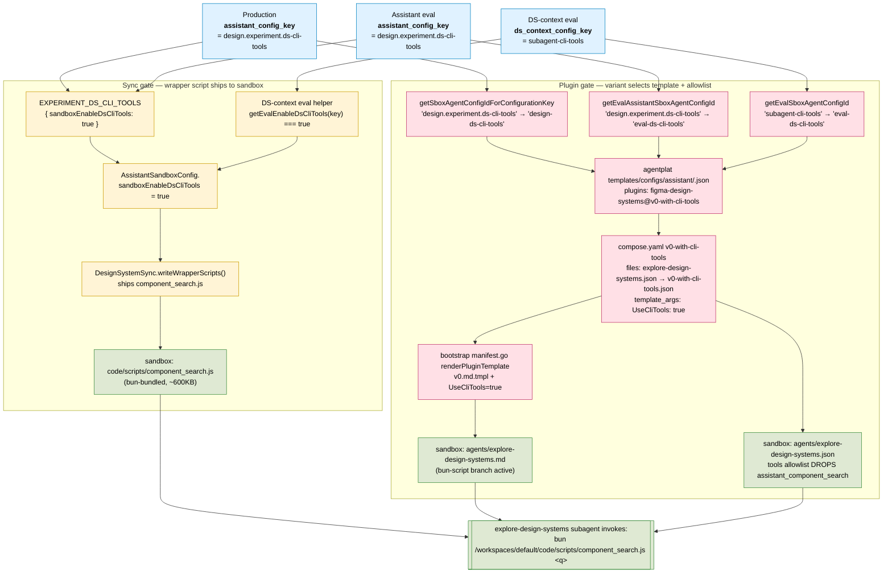

# DS CLI tools config flow

How `design.experiment.ds-cli-tools` (assistant) and `subagent-cli-tools`
(DS-context eval) drive the explore-design-systems subagent to invoke
the `bun /workspaces/default/code/scripts/component_search.js <q>`
wrapper instead of the native `assistant_component_search` MCP tool.

Two independent gates fire from a single config key — they must both
flip true (or both false) for the wrapper to actually be used:

1. **Sync gate** — `sandboxEnableDsCliTools: true` makes
   `DesignSystemSync.writeWrapperScripts` ship the bundled
   `component_search.js` to `code/scripts/` in the sandbox.
2. **Plugin gate** — the agent-config-id selects the
   `figma-design-systems@v0-with-cli-tools` plugin variant, which
   adds `UseCliTools: true` to the template_args and replaces the
   tools-allowlist json so the prompt directs the agent to the
   wrapper and the native MCP tool is no longer callable.

Three entry points converge on the same plugin variant:

## Why both gates matter

If only the sync gate fires (script ships, but plugin variant is the
default `@v0`), the subagent gets the wrapper bundle in
`code/scripts/` but its prompt still says "use the
`assistant_component_search` MCP tool" and the tools allowlist still
permits that tool — so the wrapper sits unused. This is exactly the
gap that prompted the eval-side `getEvalAssistantSboxAgentConfigId`
helper: the assistant config key flipped the sync gate on but the
plugin gate kept defaulting to `eval` agent config.

If only the plugin gate fires (variant `@v0-with-cli-tools` is loaded
but the script wasn't synced), the prompt directs the agent to a
file that doesn't exist — `bun` fails at the first invocation.

The single config key is the contract between the two gates. Adding a
new config key that should affect either path means wiring it into
both helpers OR explicitly routing through one (the default agent
config + wrapper sync both stay false unless deliberately flipped).

## Key files

| Concern | Path |
|---|---|
| Config-key declaration | `share/synapse/global/src/shared/assistant/configs/releases/design.ts` |
| Production agent-config map | `share/synapse/global/src/shared/assistant/configs/sbox_agent_config.ts` |
| Eval agent-config helpers | `misc-tools/quickval-v2-wip/src/transforms/sandbox/eval_agent_config.ts` |
| DS-context server config | `share/synapse/server/src/app/design/design_systems_context/configs.ts` |
| Agent-config json | `services/agentplat/templates/configs/assistant/{design,eval}-ds-cli-tools.json` |
| Plugin compose | `services/agentplat/templates/agents/plugins/figma-design-systems/compose.yaml` |
| Subagent prompt template | `services/agentplat/templates/agents/plugins/figma-design-systems/agents/explore-design-systems/v0.md.tmpl` |
| Sandbox plugin renderer | `services/agentplat/sbox/sboxd/internal/bootstrap/manifest.go` |
| Wrapper sync source | `share/synapse/server/src/lib/design_system_sync/scripts/component_search.ts` |
| Eval runner (assistant) | `misc-tools/quickval-v2-wip/src/transforms/run_assistant_sandbox/run_assistant_sandbox.ts` |
| Eval runner (DS-context) | `misc-tools/quickval-v2-wip/src/transforms/run_design_system_context_sandbox/run_design_system_context_sandbox.ts` |
